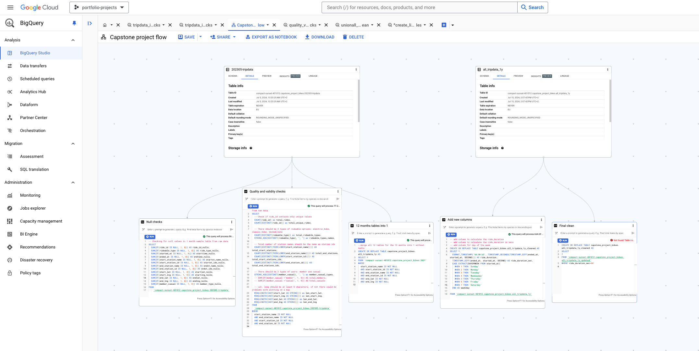
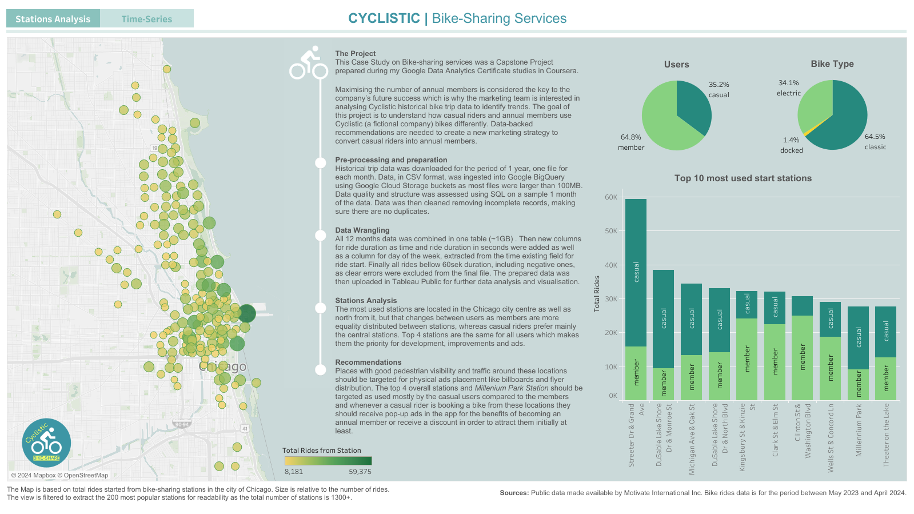

# Capstone Project | Cyclistic | Bike-sharing services success
## Brief Overview
This Case Study on Bike-sharing services was a Capstone Project prepared during my Google Data Analytics Certificate studies in Coursera. Maximising the number of annual members is considered the key to the company’s future success which is why the marketing team is interested in analysing Cyclistic historical bike trip data to identify trends. The goal of this project is to understand how casual riders and annual members use Cyclistic (a fictional company) bikes differently. Data-backed recommendations are needed to create a new marketing strategy to convert casual riders into annual members.

## Pre-processing and Data Wrangling
Historical trip data was downloaded for the period of 1 year, one file for each month. Data, in CSV format, was ingested into Google BigQuery using Google Cloud Storage buckets as most files were larger than 100MB. Data quality and structure was assessed using SQL on a sample 1 month of the data. Data was then cleaned removing incomplete records, making sure there are no duplicates. All 12 months data was combined in one table (~1GB) . Then new columns for ride duration as time and ride duration in seconds were added as well as a column for day of the week, extracted from the time existing field for ride start. Finally all rides bellow 60sek duration, including negative ones, as clear errors were excluded from the final file. The prepared data was then uploaded in Tableau Public for further data analysis and visualisation.

## Results
After preparing and cleaning the data I ingested it into Tableau for further analysis and visualisations preparation. Published in this GitHub repo are data quality checks and cleaning process in SQL, along with a 1000 rows samples in CSV format for the raw and cleaned data respectively and a [Tableau Public Dashboard](https://public.tableau.com/views/CyclisticCaseStudy_17210605199230/CyclisticCaseStudy?:language=en-US&:sid=&:redirect=auth&:display_count=n&:origin=viz_share_link) with two separate pages for Stations Analysis and Time-series Analysis. The project finishes with recommendations for the marketing campaign to be created by the marketing team in order to convert more casual riders into members.

